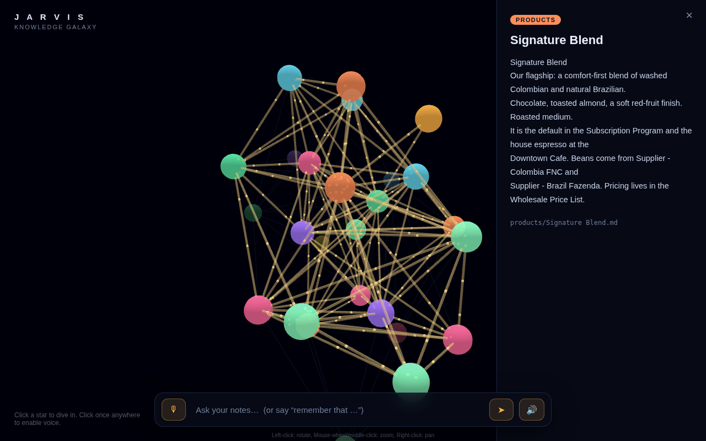

# JARVIS — a talking 3D knowledge galaxy

Build your own JARVIS: a cinematic 3D galaxy of your markdown notes, with a
voice assistant — a dry British butler — that answers *from your notes* out
loud, and flies the camera to prove exactly where each answer came from.

Built from the "Build Your Own JARVIS" prompt pack (6 prompts). No frameworks,
no build tools, no `pip install` — Python 3 standard library + one CDN script.



## What's inside

| File | What it does |
|------|--------------|
| `build.py` | Scans your `.md` notes and writes `viewer/graph-data.js` (`const GRAPH = {nodes, links}`). Generates 25 sample notes if you have none. |
| `viewer/index.html` | The single-page 3D viewer (uses the `3d-force-graph` CDN library). Galaxy, side panel, command bar, voice, fly-to-source, live "remember". |
| `server.py` | Static server for `viewer/` on **port 4700**, plus `POST /chat` (the brain) and `POST /remember` (grow the brain by voice). |
| `config.json` | `{"api_key": "...", "model": "claude-opus-4-8"}` — **lives in the project root, never served to the browser.** |

## Quick start

```bash
# 1. Build the galaxy (also generates 25 sample notes on first run)
python3 build.py                    # or:  python3 build.py /path/to/your/notes

# 2. Start the server
python3 server.py

# 3. Open in Google Chrome (mic + voice need Chrome, not Safari)
#    http://localhost:4700
```

Click a star to dive in. Type or 🎙-speak a question and JARVIS answers aloud,
then flies to the note the answer came from. Say **"remember that …"** to write a
new note and watch a new star get born.

## The brain (config)

Paste your Anthropic API key into `config.json` yourself — **never into a chat
window.** `$5` of credit at [console.anthropic.com](https://console.anthropic.com)
is plenty; answers cost fractions of a cent.

```json
{ "api_key": "sk-ant-...", "model": "claude-opus-4-8" }
```

**No API key?** Leave the placeholder in `config.json`. If the `claude` CLI is on
your PATH, `/chat` shells out to `claude -p` and runs on your Claude Code
subscription instead — slower, but free.

## The six prompts, mapped to the code

1. **The Galaxy** — `build.py` + the cinematic viewer + `server.py` (port 4700, serves `viewer/` only).
2. **The Brain** — `POST /chat`: keyword-scores every note (title matches weigh extra), takes the top 6, calls the model, returns `{answer, nodes}`. Per-session history for follow-ups.
3. **The Voice** — `speechSynthesis` (prefers a British voice) speaks answers; `webkitSpeechRecognition` mic button; "● listening… / ● thinking…" status line.
4. **The Magic** — fly-to-source: the camera dives to the top source node (or lights the whole cluster when 4+ notes were used).
5. **The Personality** — the `/chat` system prompt: a witty British butler who calls you "sir", answers in one sharp sentence, and doesn't drag the camera around during small talk. Boot greeting on load.
6. **Total Recall** — `POST /remember` writes a real note into `notes/captures/` and the galaxy adds the new star live, next to its most-related note, with a glow pulse.

## Troubleshooting

| Symptom | Fix |
|---------|-----|
| Mic button does nothing | Chrome → lock icon in the address bar → allow Microphone. Must be Chrome/Edge. |
| No sound | Click anywhere on the page once, then ask again (browsers block audio before the first interaction). |
| Page looks stale after a change | Hard reload: `Cmd+Shift+R` (Mac) / `Ctrl+Shift+R` (Windows). |
| `model not configured` / brain errors | You didn't paste your key into `config.json`, or left the placeholder text in — or set up the `claude -p` fallback. |
| Answers are generic | Your notes path was wrong — re-run `python3 build.py /full/absolute/path`. |

## Security notes

- `config.json` is in the project root, **not** in `viewer/`, and the server only
  serves files inside `viewer/` (path traversal is blocked). Your key never
  reaches the browser, the HTML, or any served file.
- `viewer/graph-data.js` is generated (it embeds an absolute notes path) and is
  git-ignored; `server.py` rebuilds it on first run.

---

*Built from the free prompt pack by Zubair Trabzada · AI Workshop.*
